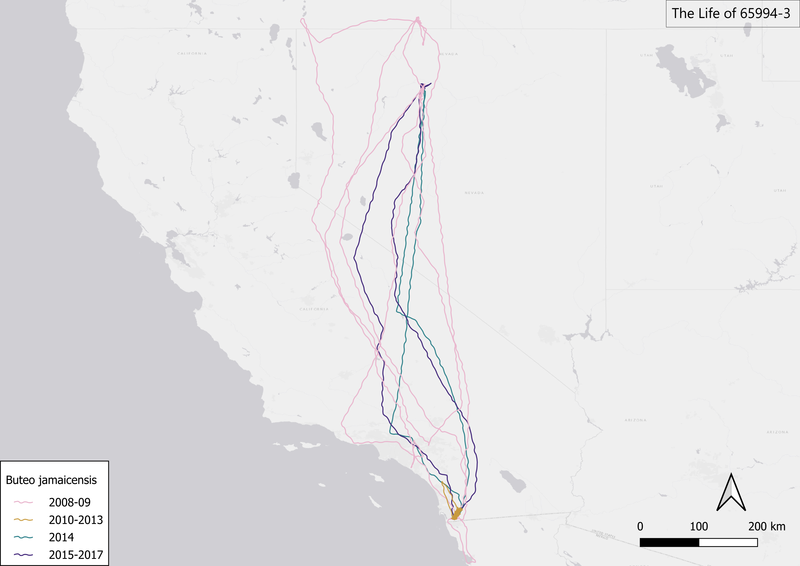
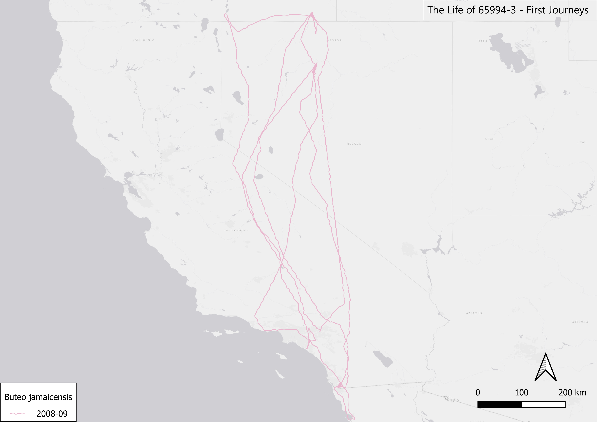
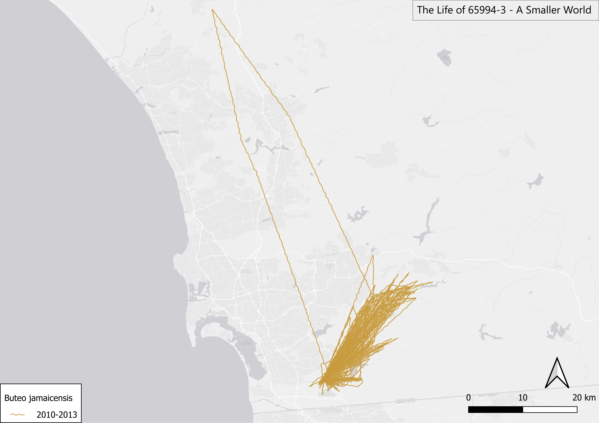
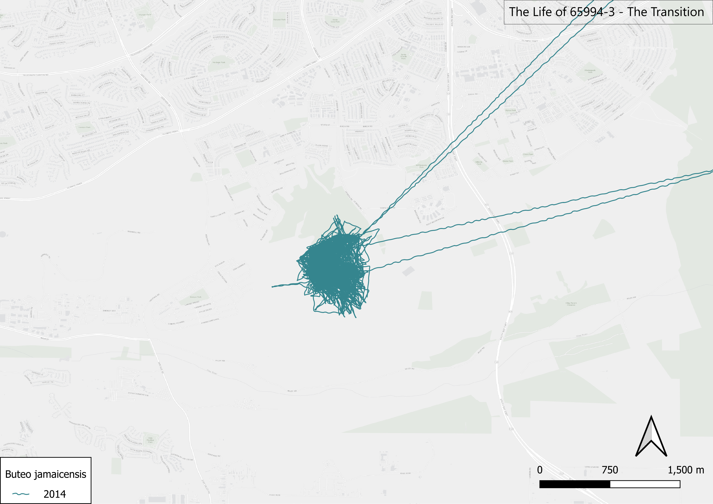
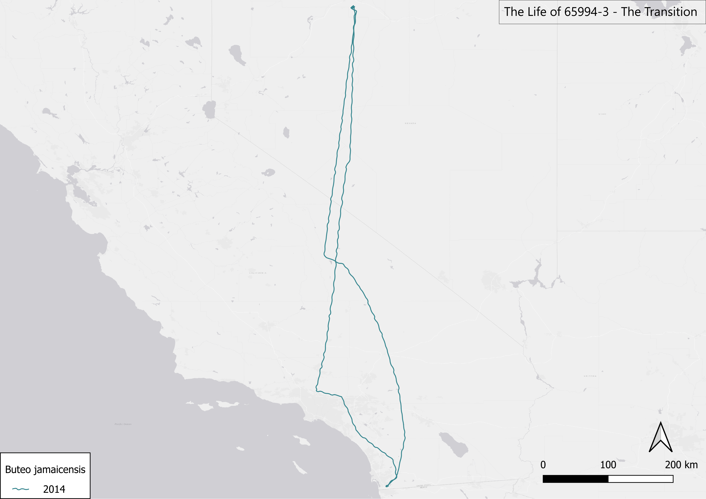

# 65994-3-Visual-Biography
A GIS visual biography of red-tailed hawk 65994-3, using Movebank telemetry and published research by Bloom and colleagues.
# The Life of 65994-3

### A Visual Biography of a Red-Tailed Hawk

*Representative photograph of a red-tailed hawk (Buteo jamaicensis). This photograph does not depict 65994-3.*

This project reconstructs the recorded life history of **65994-3**, a female red-tailed hawk (*Buteo jamaicensis*) tracked by GPS telemetry from 2008 to 2017 as part of Dr. Peter Bloom and colleagues' long-term research on red-tailed hawks in western North America.

Rather than treating thousands of telemetry records as isolated points, this project uses GIS to tell the story of one individual animal through geography. Her recorded movements are presented chronologically, allowing changes in scale, movement, and repeatedly used landscapes to emerge visually across nearly a decade of tracking.

The biological interpretation of 65994-3's movements comes from the published research of Bloom and colleagues. The contribution of this project is cartographic: using QGIS to translate that research and the underlying telemetry data into a visual biography that can be followed across space and time.

## The Visual Timeline

The maps are organized into four periods:

- **2008–2009 — First Journeys**
- **2010–2013 — A Smaller World**
- **2014 — The Transition**
- **2015–2017 — The Final Fixes**

These periods are used as a visual storytelling structure rather than as newly proposed biological classifications.
---

## The Life of 65994-3

Before separating her recorded movements into individual periods, the complete telemetry record provides a view of the geographic scale of 65994-3's tracked life.

Across the full record, the contrast between periods is immediately visible. Her earliest recorded years span large portions of the western United States, while other periods occupy much smaller geographic areas. The maps that follow revisit this record chronologically, changing scale as her recorded geography changes.

<em>Map caption: The complete recorded movement history of 65994-3. Colors represent the four chronological periods used throughout this visual biography. Lines connect consecutive GPS fixes to visualize movement between recorded locations.</em>
---

## First Journeys
### 2008–2009

65994-3 was fitted with a satellite transmitter as a nestling in southern California on June 21, 2008. Within months, her recorded movements extended hundreds of kilometers north of her natal region.

Bloom et al. (2015) documented two northward summer migrations during these early years. In 2008, 65994-3 reached a maximum straight-line distance of 932 km (579 mi) from her natal nest before returning south. She migrated north again in 2009, reaching 786 km (488 mi) from her natal nest.

These early journeys form the largest geographic feature of the opening years of her visual biography.

*Recorded movements of 65994-3 during 2008–2009. At this scale, the geographic extent of her earliest tracked journeys becomes visible.*

**Research context:** Bloom et al. (2015), *Northward Summer Migration of Red-Tailed Hawks Fledged from Southern Latitudes*, Journal of Raptor Research 49(1):1–17.
---

## A Smaller World
### 2010–2013

After the long-distance movements of her first two tracked years, the geographic scale of 65994-3's recorded movements changed dramatically.

Bloom et al. (2015) reported that 65994-3 ceased migrating after her first two annual migrations and formed a pair bond. From 2010 through 2013, her telemetry record is visually dominated by much more localized movement in southern California.

The change in map scale is intentional. After viewing movements spanning hundreds of kilometers, this closer view emphasizes how geographically concentrated this period of her recorded life became.

*Recorded movements of 65994-3 during 2010–2013. The map is shown at a much closer scale than the preceding chapter to make the change in her recorded geographic footprint visible.*

**Research context:** Bloom et al. (2015), *Northward Summer Migration of Red-Tailed Hawks Fledged from Southern Latitudes*, Journal of Raptor Research 49(1):1–17.
---

## The Transition
### 2014

After several years of more localized recorded movement, 2014 marked a major change in 65994-3's documented life history.

McCrary et al. (2019) reported that 65994-3 resumed northward migration in 2014 after several years of residency. Her telemetry once again extended far beyond southern California, with movements into Nevada.

Rather than showing this change at a single scale, the following three maps move from a localized view outward to the full geographic extent of the recorded movement, then return to a closer view farther north.

*At a local scale, the beginning of the 2014 chapter remains geographically concentrated.*

*Pulling outward reveals the much larger geographic extent contained within the same year.*

*Returning to a local scale reveals concentrated recorded movement farther north. This geographic frame will appear again later in the biography.*

**Research context:** McCrary, M.D., Bloom, P.H., Porter, K.K. & Sernka, K.J. (2019), *Facultative Migration: New Insight from a Raptor*, Journal of Raptor Research 53(1):84–90.
