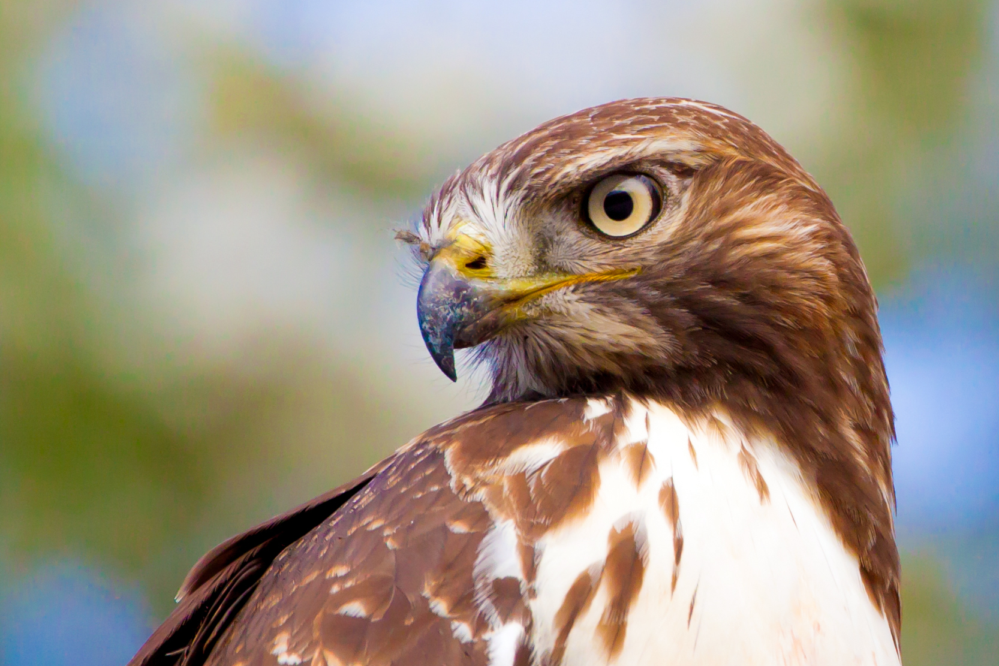

# 65994-3-Visual-Biography
A GIS visual biography of red-tailed hawk 65994-3, using Movebank telemetry and published research by Bloom and colleagues.
# The Life of 65994-3

### A Visual Biography of a Red-Tailed Hawk

*Representative photograph of a red-tailed hawk (Buteo jamaicensis). This photograph does not depict 65994-3.*

This project reconstructs the recorded life history of **65994-3**, a female red-tailed hawk (*Buteo jamaicensis*) tracked by GPS telemetry from 2008 to 2017 as part of Dr. Peter Bloom and colleagues' long-term research on red-tailed hawks in western North America.

Rather than treating thousands of telemetry records as isolated points, this project uses GIS to tell the story of one individual animal through geography. Her recorded movements are presented chronologically, allowing changes in scale, movement, and repeatedly used landscapes to emerge visually across nearly a decade of tracking.

The biological interpretation of 65994-3's movements comes from the published research of Bloom and colleagues. The contribution of this project is cartographic: using QGIS to translate that research and the underlying telemetry data into a visual biography that can be followed across space and time.

## The Visual Timeline

The maps are organized into four periods:

- **2008–2009 — First Journeys**
- **2010–2013 — A Smaller World**
- **2014 — The Transition**
- **2015–2017 — The Final Fixes**

These periods are used as a visual storytelling structure rather than as newly proposed biological classifications.
